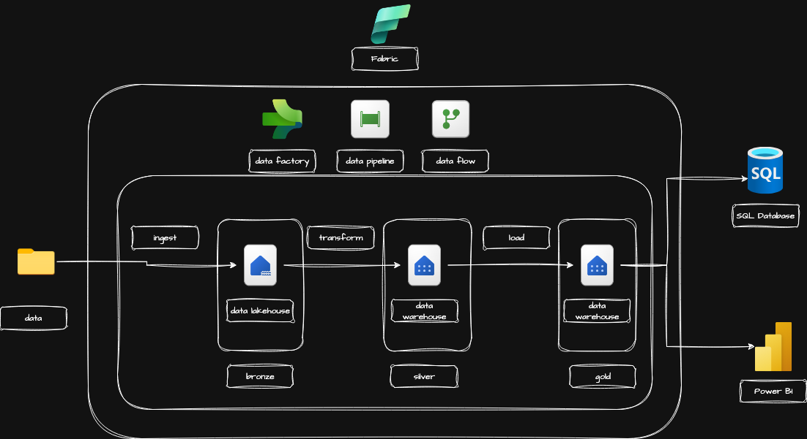

  
  

    <h1 style="margin: 0;">Welcome to My Portfolio</h1>
    
<em>Data Analytics Engineer | AI Enthusiast | Cloud Native Builder</em>

  

---

# 👋 Hi, I'm Josh Dang

I’m a Data Analytics Engineer with a strong passion for building end-to-end data-driven solutions. I specialize in designing and implementing data pipelines that collect, transform, and deliver insights across the organization. With a solid understanding of both cloud infrastructure and modern data engineering practices, I focus on creating scalable, automated systems that support reporting, analytics, and machine learning use cases. My goal is to turn raw data into reliable, actionable intelligence that drives better decision-making and business outcomes.

---

## 🚀 Featured Projects
### 🔹 [Customer Churn App](https://github.com/JoshPDang/telcochurnapp)

This project focuses on building an end-to-end machine learning solution to predict whether a customer is likely to churn from a telecom subscription service. Using the Telco Customer Churn dataset, the pipeline includes data preprocessing, feature engineering, model training, and deployment. The trained model is served via a FastAPI application hosted on Azure App Service, making it accessible through a REST API. The entire solution is integrated with Azure DevOps to enable automated CI/CD for code updates, testing, and deployment. To ensure observability and reliability in production, the application is instrumented with custom metrics and traces that are visualized in Grafana, powered by Prometheus and Jaeger. This project demonstrates how machine learning models can be effectively operationalized using modern cloud-native tools and DevOps best practices.

### 🔹 [NYC Taxi Data Pipeline](https://github.com/JoshPDang/nyc-taxi-pipeline)
In this project, I will implement a complete end-to-end data flow, covering all stages from data ingestion to final visualization. The primary objective is to create a seamless data pipeline using Azure Data Factory (ADF), which will automate data movement, transformation, and loading processes. The dataset I will use is the NYC Taxi dataset, which contains detailed trip data, including pick-up and drop-off locations, passenger counts, fares, and other relevant metrics.

The workflow will begin with the scraping the downlink from a website then ingest into Azure blob storage, followed by transformation steps such as cleaning, aggregation, and enrichment of the data (e.g., adding taxi zone information). I will implement these transformations using ADF’s data flow transformations, Databricks and pipeline orchestration features to ensure efficient processing.

The transformed data will then be stored in a suitable target for visualization, such as a data warehouse or storage account, where I can connect to visualization tools like Power BI or Tableau. This visualization will provide key insights into taxi trends, including trip frequency, passenger behavior, and fare distribution across different regions and times.

This project will demonstrate my ability to build a scalable, automated data pipeline using ADF’s scheduling and orchestration capabilities, efficiently handling data transformations and integrating with visualization tools to derive actionable insights from the NYC Taxi dataset.

### 🔹 [Analytic Dash Board for Formula1 Dataset using MS Farbic](https://github.com/JoshPDang/Formula1_MSFabric)

In this project, I will develop an end-to-end analytic dashboard using the Formula 1 dataset, leveraging Microsoft Fabric to manage and process data efficiently. The solution will incorporate key components of Microsoft Fabric, including Lakehouse, Warehouse, Data Pipeline, Dataflow and PowerBI, to facilitate a seamless data engineering and analytics workflow.

The project will follow the Medallion Architecture, which organizes data into three distinct layers:

Bronze Layer: Raw, unprocessed data will be ingested and stored in the Lakehouse. This layer serves as the single source of truth for all raw data collected.
Silver Layer: The data will undergo cleaning, transformation, and validation to produce refined datasets. These intermediate datasets will be stored in the Data Warehouse for further processing and analysis.
Gold Layer: Aggregated and enriched datasets, optimized for reporting and analytics, will also be stored in the Data Warehouse. This layer serves as the foundation for the final analytical outputs and visualizations.
By implementing this architecture, I aim to ensure data quality, scalability, and performance while creating an interactive analytic dashboard to uncover insights from the Formula 1 dataset. The dashboard will provide meaningful visualizations, enabling users to explore trends, patterns, and key metrics in Formula 1 racing.

---

## 🛠 Tools & Technologies

- **Languages & Data Processing:** Python, SQL, Pandas, PySpark  
- **Data Engineering & ETL:** dbt, Airflow, Delta Lake, Microsoft Fabric (Dataflows, Pipelines)  
- **Cloud Platforms:** Azure (Data Factory, ADLS, Synapse), AWS (S3, EC2)  
- **Data Warehousing:** Databricks, Snowflake  
- **Streaming & Messaging:** Kafka, Debezium  
- **Infrastructure:** Docker, Kubernetes  
- **ML Serving & Monitoring:** FastAPI, Prometheus, Grafana

---

## 🎓 Certifications

| Certification | Issuer | Issued | Expires |
|---------------|--------|--------|---------|
| **Microsoft Certified: Fabric Analytics Engineer Associate** Credential ID: 99IDF0830AF2C29 | Microsoft | Jan 2025 | Jan 2026 |
| **Microsoft Certified: Azure Data Engineer Associate** Credential ID: 6C35E8-FD844B <em>Skills:</em> Azure Data Factory, Synapse Analytics, Event Hubs, Stream Analytics, Azure Databricks | Microsoft | Nov 2024 | Nov 2025 |
| **Microsoft Certified: Azure AI Fundamentals** [View Credential](https://www.credly.com/badges/3a871df2-e082-4f84-bcb6-e4b963176e51) | Microsoft | Apr 2025 | *No expiry* |
| **AWS Certified Cloud Practitioner** Credential ID: 27CCQ9DCXJ1QQGSB | AWS | Jun 2023 | Jun 2026 |
| **Databricks Certified Data Engineer Associate** Credential ID: 77430386 <em>Skills:</em> Data Engineering, ETL, Data Governance | Databricks | Jul 2023 | Jul 2025 |
| **Databricks Lakehouse Fundamentals** Credential ID: 76661903 | Databricks | Jun 2023 | Jun 2024 |

---

## 📫 Get in Touch

- 📞 Phone: 0413 179 975  
- ✉️ Email: [tphuocmail@gmail.com](mailto:tphuocmail@gmail.com)  
- 💼 LinkedIn: [linkedin.com/in/joshphuocthanhdang](https://linkedin.com/in/joshphuocthanhdang)

---
